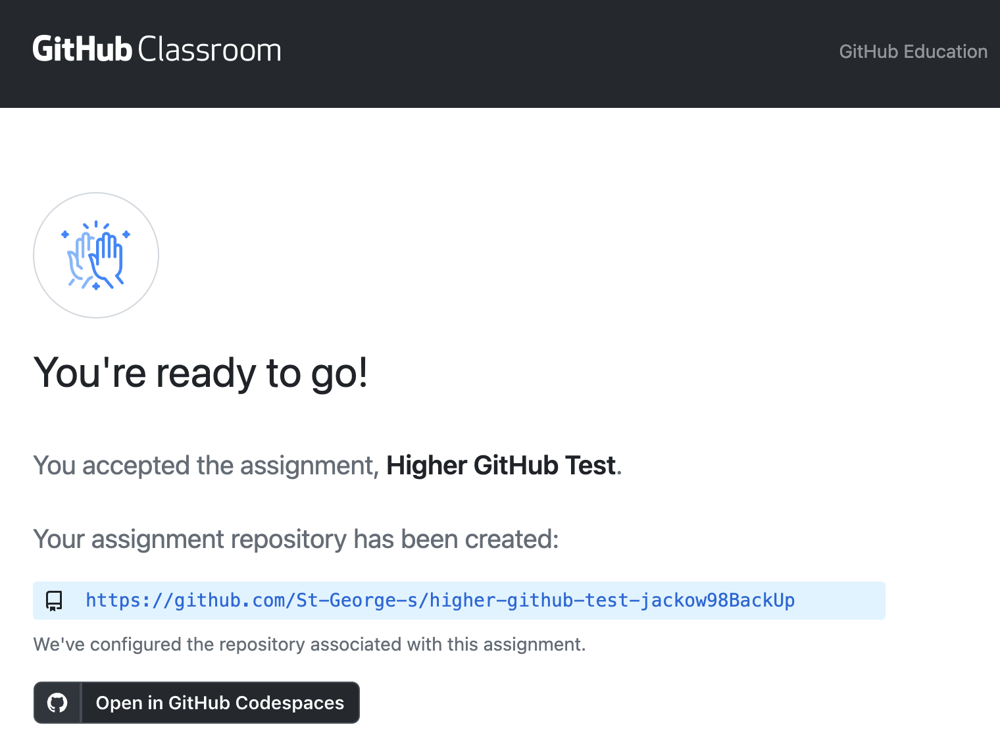
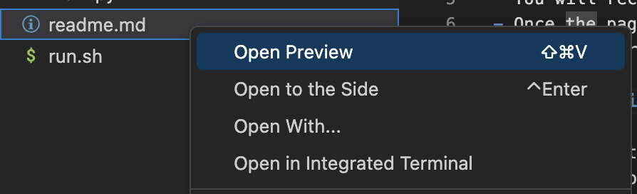

# Getting Started with GitHub Classroom, Codespaces, and VSCode

### 1. **Accepting an Assignment**

- You will receive a link to your assignment. Click on it.
- Once the page loads, click on the "Accept Assignment" button.

### 2. **Opening the Codespace**

- After accepting the assignment, click on the "Open in Codespace" button.
- This will load a development environment similar to Replit, but it’s called **VSCode**.

### 3. **Waiting for Codespace to Set Up**

- When VSCode loads, it will take a minute or two to set up. It’s installing Python and other necessary tools.
- During this time, you might see an extension with a loading icon in the bottom left corner.

### 4. **Running Your Code**

- Once everything is ready, find the file named `main.py` in the file explorer on the left.
- Click on `main.py` to open it.
- To run the code, click the small "play" button at the top right of the editor.
- Your code will execute, and you should see the output in the terminal at the bottom.

### 5. **Viewing Instructions in Markdown**

- Your instructions might be in a `.md` (Markdown) file. To see them in a nicely formatted view:
    - Right-click on the `.md` file in the file explorer.
    - Select "Open Preview".
- This will show you a clean, formatted version of your instructions.

### 6. **Editing and Running Code**

- You can edit the `main.py` file directly. After making changes, you can run the code again by clicking the "play" button.
- If you need to add more files or folders, right-click in the file explorer and select "New File" or "New Folder".

### 7. **Committing Your Work**

- When you’ve finished your work, it’s time to commit your changes.
- Click on the branch icon in the bottom left corner.
- Click "Commit".
- Select "Always" to confirm.
- Write a short message to let me know what you did.
- Click the tick mark to commit your changes.
- Finally, click on "Sync Changes" to upload your work to GitHub.

